<div align="center">

```ascii
╔═══════════════════════════════════════════════════════════════════════════════════════════════════════════╗
║                                                                                                           ║
║     ██████╗  █████╗  ██████╗  █████╗ ███╗   ██╗██████╗ ███████╗███████╗██████╗     ██████╗  █████╗ ██╗    ║
║    ██╔════╝ ██╔══██╗██╔════╝ ██╔══██╗████╗  ██║██╔══██╗██╔════╝██╔════╝██╔══██╗    ██╔══██╗██╔══██╗██║    ║
║    ██║  ███╗███████║██║  ███╗███████║██╔██╗ ██║██║  ██║█████╗  █████╗  ██████╔╝    ██████╔╝███████║██║    ║
║    ██║   ██║██╔══██║██║   ██║██╔══██║██║╚██╗██║██║  ██║██╔══╝  ██╔══╝  ██╔═══╝     ██╔══██╗██╔══██║██║    ║
║    ╚██████╔╝██║  ██║╚██████╔╝██║  ██║██║ ╚████║██████╔╝███████╗███████╗██║         ██║  ██║██║  ██║██║    ║
║     ╚═════╝ ╚═╝  ╚═╝ ╚═════╝ ╚═╝  ╚═╝╚═╝  ╚═══╝╚═════╝ ╚══════╝╚══════╝╚═╝         ╚═╝  ╚═╝╚═╝  ╚═╝╚═╝    ║
║                                                                                                           ║
║                                    ISE UNDERGRAD | SYSTEMS PROGRAMMING                                    ║
║                                                                                                           ║
╚═══════════════════════════════════════════════════════════════════════════════════════════════════════════╝
```

<p align="center">
  <a href="https://linkedin.com/in/gagandeeprai" target="_blank">
    
  </a>
  <a href="https://my-portfolio-gagandeeprai.vercel.app/" target="_blank">
    
  </a>
  <a href="mailto:gagandeepputtur@gmail.com">
    
  </a>
  <a href="https://github.com/Gagandeeprai" target="_blank">
    
  </a>
</p>


</div>

## 👨💻 About Me

<table>
  <tr>
    <td valign="top" width="60%">
      <pre><code class="language-python">class Developer:
    def __init__(self):
        self.name = "Gagandeep Rai"
        self.location = "India 🇮🇳"
        self.education = "Information Science Engineering"
        self.interests = [
            "Machine Learning & AI",
            "Low-Level Systems",
            "Open Source Contributions"
        ]
    def say_hi(self):
        print("Thanks for dropping by! Let's build something amazing together!")

me = Developer()
me.say_hi()</code></pre>
    </td>
    <td valign="top" width="40%">
      <div align="center">
        
      </div>
    </td>
  </tr>
</table>

<br clear="all"/>

<br clear="all"/>

---

## 🛠️ Tech Stack

<div align="center">

### 💻 Languages


### 🎨 Frontend Development


### ⚙️ Backend & ML


### 🔧 Tools & Platforms


</div>

---

## 🚀 Featured Projects

<div align="center">

<table>
<tr>
<td width="50%" valign="top">

<div align="center">
<h3>🛡️ Phishing Detector</h3>

[](https://github.com/Gagandeeprai/Phishing-detector)


**ML-Powered Browser Extension for Real-Time Threat Detection**

A sophisticated phishing detection system that combines machine learning with modern web technologies. The Python backend uses **Scikit-learn** and **FastAPI** for intelligent URL classification, while the sleek Chrome extension built with **React** and **Vite** provides instant security warnings.

</div>

**🔥 Key Features:**
- ⚡ Real-time URL analysis
- 🤖 ML-based threat detection
- 🔔 Instant browser notifications
- 🪶 Lightweight & blazing fast

**💡 Tech Stack:**
```
Python • FastAPI • Scikit-learn
React • Vite • Chrome Extension API
```

</td>
<td width="50%" valign="top">

<div align="center">
<h3>🧩 Terminal Tetris</h3>

[](https://github.com/Gagandeeprai/terminal-tetris)


**Classic Tetris in the Linux Terminal**

A fast-paced **Tetris clone written in C using Ncurses**, bringing the classic arcade experience directly into the terminal. Features real-time keyboard controls, collision detection, scoring, and smooth gameplay rendered entirely in the terminal UI.

</div>

**🔥 Key Features:**
- 🎮 Classic Tetris gameplay
- ⚡ Real-time keyboard input
- 🧱 Collision detection & piece rotation
- 📊 Score tracking system

**💡 Tech Stack:**
```
C • Pthreads • Ncurses
Makefile • Linux
```

</td>
</tr>

<tr>
<td width="50%" valign="top">

<div align="center">
<h3>🌌 Panchanga App</h3>

[](https://github.com/Gagandeeprai/panchanga-app)


**Vedic Astronomy Mobile Assistant**

A beautiful mobile application built with **Expo** and **React Native** that calculates daily Tithi, Nakshatra, Yoga, and sunrise/sunset times based on accurate astronomical calculations.

</div>

**🔥 Key Features:**
- 📅 Daily Panchanga calculations
- 📍 Location-based timings
- 🎯 Clean, intuitive UI
- 📱 Cross-platform support

**💡 Tech Stack:**
```
React Native • Expo
TypeScript • Astronomy Engine
```

</td>
<td width="50%" valign="top">

<div align="center">
<h3>🎨 Modern Portfolio</h3>

[](https://github.com/Gagandeeprai/Portfolio)


**Personal Developer Showcase**

A sleek, modern portfolio website built with cutting-edge technologies **Next.js 16** and **Framer Motion**, featuring buttery smooth animations, responsive design, and optimized performance.

</div>

**🔥 Key Features:**
- 🎬 Smooth page transitions
- 📱 Fully responsive design
- 🌙 Dark mode optimized
- 🚀 SEO friendly

**💡 Tech Stack:**
```
Next.js 16 • React 19
Tailwind CSS • Framer Motion
```

</td>
</tr>
</table>

</div>

---

# 📊 GitHub Stats:
<br/>
<br/>


---

## 🤝 Let's Connect!

<div align="center">

**Open to collaborations, interesting projects, and tech discussions!**

<br>

<a href="https://linkedin.com/in/gagandeeprai" target="_blank">
  
</a>
<a href="https://my-portfolio-gagandeeprai.vercel.app/" target="_blank">
  
</a>
<a href="mailto:gagandeepputtur@gmail.com">
  
</a>
<a href="https://github.com/Gagandeeprai" target="_blank">
  
</a>

<br><br>

[](https://visitcount.itsvg.in)

<!-- Proudly created with GPRM ( https://gprm.itsvg.in ) -->

<br><br>


**⭐ From [Gagandeeprai](https://github.com/Gagandeeprai)**

**Thanks for visiting! Let's build something amazing together 🚀**

</div>
